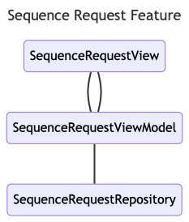
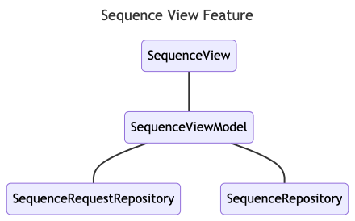

# FizzBuzz
FizzBuzz is my implementation of the Kreactive FizzBuzz technical challenge and was made as my
submission for a technical interview.

## Architecture
The FizzBuzz app is implemented using MVVM architecture, which was chosen because MVVM is the 
recommended app architecture for android projects by Google. The project is composed of two 
feature stacks for requesting and viewing a sequence that are organized into one module. Note 
the project is not modularized because its size and complexity doesn't warrant it.

### Sequence Request Feature
The sequence request feature allows clients to request a sequence to view, by inputting two 
integers, two words, and a limit for the sequence. The sequence request feature is composed of
the following classes:

The `SequenceRequestView` interacts with the `SequenceRequestViewModel` to determine the state of
its components, given any user input. The `SequenceRequestViewModel`, interacts with the 
`SequenceRequestRepository` to save a valid request when the user decides to submit it.

### Sequence View Feature
The sequence view feature allows clients to view the sequence they have requested, by pressing 
the `Submit` button on valid input. The sequence view feature is composed of the following classes:

The `SequenceView` consumes from the `SequenceViewModel` to determine its contents. The
`SequenceViewModel`, queries the `SequenceRequestRepository` to determine the current 
`SequenceRequest` and passes this information to the `SequenceRepository` to generate the desired
sequence.

## Trade Offs
Although entirely possible, I decided not to incorporate the following features:

1. Dependency Injection - the dependencies tree was not complicated enough to rationalize the 
inclusion of a DI framework like Koin or Hilt.
2. Caching - Since the sequences are represented as type `Sequence`, no computations are done except 
when absolutely necessary. This is more efficient than serializing or deserializing sets of 
sequences to avoid duplicate computations.
3. Network Requests - If there is ever a desire to support sequences of a length longer than the
max value of an integer, it would be wise to incorporate an interface in `SequenceRepository` and
introduce an implementation that receives the desired sequence from a cloud-hosted API. However,
in this case it was simply decided to limit the size of the requested sequence.

## Design Patterns Used
* The `SequenceRequestRepository` implements the **singleton** design pattern to keep an instance of
a `SequenceRequest` stored in memory.
* The `SequenceRequestRepository` implements the `SequenceRequestStore` interface which is used 
for a **strategy** design pattern to allow a mock instance of the repository (for testing).
* The `Logger` class implements an **adapter** pattern.

## Languages Supported
This application is localized to support the following languages:
* French
* English

## License
["License"](./LICENSE)